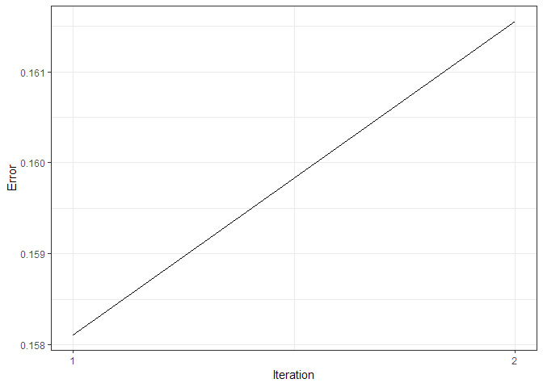

<!-- README.md is generated from README.Rmd. Please edit that file -->

[](https://travis-ci.org/kvantas/missTune)
[](https://ci.appveyor.com/project/kvantas/missTune)
[](https://codecov.io/github/kvantas/missTune?branch=master)

# missTune

This package is an alternative implementation of the `missForest` and
`missRanger` packages using tuned Random Forests. The `tuneRF` function
from the `randomForest` is used internally to find the optimal mtry
parameter.

## Installation

You can install the development version from Github with:

``` r
# install.packages("devtools")
devtools::install_github("kvantas/missTune")
```

## Example

This is a basic example about infilling a dataset.

``` r
library(missTune)
# create random na values
iris_na <- generate_na(iris, p = 0.1, seed = 123)

# infill values
res_imp <- miss_tune(x_miss = iris_na, num_trees = 100, verbose = TRUE)
#> iteration 1 in progress...
#>      Species  Sepal.Width Sepal.Length  Petal.Width Petal.Length 
#>    0.1200000    0.5980840    0.2663487    0.1828715    0.1572906
#> iteration 2 in progress...
#>      Species  Sepal.Width Sepal.Length  Petal.Width Petal.Length 
#>   0.15333333   0.48446102   0.22064238   0.08361425   0.05196673
#> iteration 3 in progress...
#>      Species  Sepal.Width Sepal.Length  Petal.Width Petal.Length 
#>   0.14666667   0.45839119   0.21097684   0.06487464   0.04029760
#> iteration 4 in progress...
#>      Species  Sepal.Width Sepal.Length  Petal.Width Petal.Length 
#>   0.13333333   0.45272425   0.20567989   0.06389462   0.03387247
#> iteration 5 in progress...
#>      Species  Sepal.Width Sepal.Length  Petal.Width Petal.Length 
#>   0.13333333   0.45343388   0.19657560   0.06425708   0.03517974
#> iteration 6 in progress...
#>      Species  Sepal.Width Sepal.Length  Petal.Width Petal.Length 
#>   0.13333333   0.43683262   0.19084860   0.06635940   0.04000778
#> iteration 7 in progress...
#>      Species  Sepal.Width Sepal.Length  Petal.Width Petal.Length 
#>   0.12000000   0.44209146   0.19945041   0.06407109   0.03444584
#> iteration 8 in progress...
#>      Species  Sepal.Width Sepal.Length  Petal.Width Petal.Length 
#>   0.13333333   0.42924268   0.21242245   0.06168465   0.03638981
```

Let’s view the original data-set with the missing values and the
infilled one.

``` r
head(iris_na)
#>   Sepal.Length Sepal.Width Petal.Length Petal.Width Species
#> 1          5.1         3.5          1.4         0.2  setosa
#> 2          4.9         3.0          1.4         0.2  setosa
#> 3          4.7         3.2          1.3         0.2  setosa
#> 4          4.6         3.1          1.5         0.2  setosa
#> 5           NA         3.6          1.4         0.2  setosa
#> 6          5.4         3.9          1.7         0.4  setosa
head(res_imp$x_imp)
#>   Sepal.Length Sepal.Width Petal.Length Petal.Width Species
#> 1     5.100000         3.5          1.4         0.2  setosa
#> 2     4.900000         3.0          1.4         0.2  setosa
#> 3     4.700000         3.2          1.3         0.2  setosa
#> 4     4.600000         3.1          1.5         0.2  setosa
#> 5     5.059694         3.6          1.4         0.2  setosa
#> 6     5.400000         3.9          1.7         0.4  setosa
```

And finally let’s create a plot with the mean out of bag error during
the iterations of the algorithm.

``` r
library(ggplot2)
mean_errors <- unlist(lapply(res_imp$oob_list, mean))
ggplot()+
  geom_line(aes(x = 1: length(mean_errors), mean_errors)) +
  scale_x_continuous(breaks = 1: length(mean_errors)) + 
  xlab("Iteration") + ylab("Error")+
  theme_bw()
```


