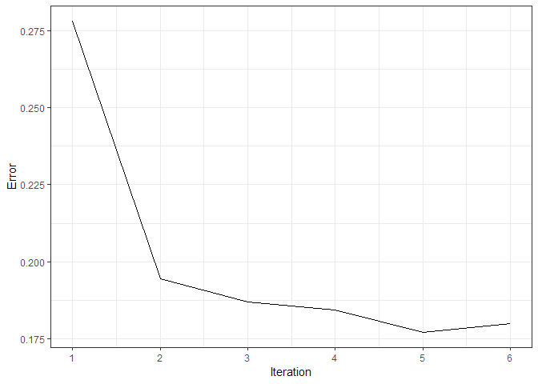

<!-- README.md is generated from README.Rmd. Please edit that file -->

[](https://travis-ci.org/kvantas/missTune)
[](https://ci.appveyor.com/project/kvantas/missTune)
[](https://codecov.io/github/kvantas/missTune?branch=master)

# missTune

This package is an alternative implementation of the `missRanger`
package using tuned Random Forests.

## Installation

You can install the development version from Github with:

``` r
# install.packages("devtools")
devtools::install_github("kvantas/missTune")
```

## Example

This is a basic example about infilling a dataset.

``` r
library(missTune)
# create random na values
iris_na <- generate_na(iris, p = 0.1, seed = 123)

# infill values
res_imp <- miss_tune(x_miss = iris_na, num_trees = 100, tune_length = 5, verbose = TRUE)
#> iteration 1 in progress...
#>      Species  Sepal.Width Sepal.Length  Petal.Width Petal.Length 
#>   0.07407407   0.50246231   0.21855087   0.05955316   0.02601700
#> iteration 2 in progress...
#>      Species  Sepal.Width Sepal.Length  Petal.Width Petal.Length 
#>   0.05925926   0.44848441   0.16532591   0.05722056   0.03140818
#> iteration 3 in progress...
#>      Species  Sepal.Width Sepal.Length  Petal.Width Petal.Length 
#>   0.04444444   0.43116893   0.15934408   0.05232997   0.02949629
#> iteration 4 in progress...
#>      Species  Sepal.Width Sepal.Length  Petal.Width Petal.Length 
#>   0.05185185   0.45780364   0.15951577   0.05190935   0.03750395
```

Let’s view the original data-set with the missing values and the
infilled one.

``` r
head(iris_na)
#>   Sepal.Length Sepal.Width Petal.Length Petal.Width Species
#> 1          5.1         3.5          1.4         0.2  setosa
#> 2          4.9         3.0          1.4         0.2  setosa
#> 3           NA         3.2          1.3         0.2  setosa
#> 4          4.6         3.1          1.5          NA  setosa
#> 5          5.0          NA           NA         0.2  setosa
#> 6          5.4         3.9          1.7          NA  setosa
head(res_imp$x_imp)
#>   Sepal.Length Sepal.Width Petal.Length Petal.Width Species
#> 1     5.100000    3.500000     1.400000   0.2000000  setosa
#> 2     4.900000    3.000000     1.400000   0.2000000  setosa
#> 3     4.611667    3.200000     1.300000   0.2000000  setosa
#> 4     4.600000    3.100000     1.500000   0.1966251  setosa
#> 5     5.000000    3.289061     1.433344   0.2000000  setosa
#> 6     5.400000    3.900000     1.700000   0.3090928  setosa
```

And finally let’s create a plot with the mean out of bag error during
the iterations of the algorithm.

``` r
library(ggplot2)
mean_errors <- unlist(lapply(res_imp$oob_list, mean))
ggplot()+
  geom_line(aes(x = 1: length(mean_errors), mean_errors)) +
  scale_x_continuous(breaks = 1: length(mean_errors)) + 
  xlab("Iteration") + ylab("Error")+
  theme_bw()
```


